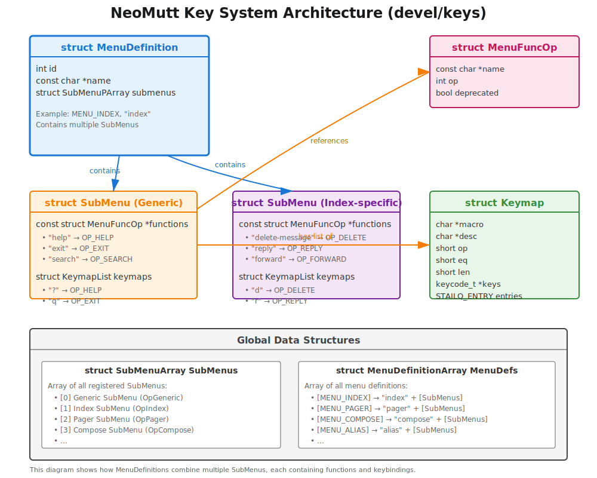

I'll analyze the changes in the `devel/keys` branch and create comprehensive technical documentation along with an architectural diagram. Let me try a different approach to explore the branch: Let me gather more specific information about the key structures and the architecture changes in the devel/keys branch. Let me search for more structural information about the new architecture. Now I have enough information to create comprehensive technical documentation. Let me analyze what I've learned:

**Key Changes in `devel/keys` branch:**

1. **New Architecture**: The branch introduces `SubMenu` and `MenuDefinition` structures to better organize functions, menus, and keybindings
2. **Separation of Concerns**: Functions are separated from keybindings - functions are registered once in SubMenus, and MenuDefinitions combine SubMenus
3. **Refactoring**: Major refactoring of how keybindings are stored and looked up

Let me create the documentation and SVG diagram: 

# Technical Documentation:  Key System Refactoring (`devel/keys` branch)

## Overview

The `devel/keys` branch introduces a comprehensive refactoring of how **functions**, **menus**, and **keybindings** are organized and stored in NeoMutt.  This refactoring breaks up dependencies, introduces cleaner abstractions, and provides better separation of concerns.

## Architecture Changes

### Previous Architecture
- Functions and keybindings were tightly coupled
- Each menu type had its own `KeymapList` directly stored in a global `Keymaps[]` array
- Function lookup required iterating through menu-specific function tables
- Generic menu functions were handled specially in multiple places

### New Architecture

The new architecture introduces three key abstractions:

#### 1. **SubMenu** (`struct SubMenu`)
A SubMenu represents a collection of related functions and their keybindings. 

```c
struct SubMenu
{
  const struct MenuFuncOp *functions;   ///< All available functions
  struct KeymapList        keymaps;     ///< All keybindings
};
```

**Purpose**: 
- Groups related functions together (e.g., all "generic" functions that apply across multiple menus)
- Stores the keybindings specific to those functions
- Can be shared across multiple menus

#### 2. **MenuDefinition** (`struct MenuDefinition`)
A MenuDefinition represents a complete menu by combining multiple SubMenus.

```c
struct MenuDefinition
{
  int                   id;         ///< Menu ID, e.g.  #MENU_ALIAS
  const char           *name;       ///< Menu name, e.g. "alias"
  struct SubMenuPArray  submenus;   ///< Parts making up the Menu
};
```

**Purpose**:
- Defines a complete menu (e.g., "index", "pager", "alias")
- Combines multiple SubMenus (e.g., menu-specific + generic)
- Provides a single point for menu configuration

#### 3. **Keymap** (`struct Keymap`)
Unchanged structurally, but now lives within SubMenus rather than directly in global arrays.

```c
struct Keymap
{
  char *macro;                  ///< Macro expansion (op == OP_MACRO)
  char *desc;                   ///< Description of a macro for the help menu
  short op;                     ///< Operation to perform
  short eq;                     ///< Number of leading keys equal to next entry
  short len;                    ///< Length of key sequence
  keycode_t *keys;              ///< Key sequence
  STAILQ_ENTRY(Keymap) entries; ///< Linked list
};
```

## Key Data Structures

### MenuFuncOp
Maps function names to operations: 

```c
struct MenuFuncOp
{
  const char *name;     ///< Name of the function (e.g., "delete-entry")
  int op;               ///< Operation code (e.g., OP_DELETE)
  bool deprecated;      ///< Whether function is deprecated
};
```

### MenuOpSeq
Maps operations to default key sequences:

```c
struct MenuOpSeq
{
  int op;               ///< Operation (e.g., OP_DELETE)
  const char *seq;      ///< Default key binding (e.g., "d")
};
```

## Initialization Flow

The new initialization process follows this pattern:

### 1. **Generic Menu Initialization**
```c
struct SubMenu *generic_init_keys(void)
{
  // Register Generic SubMenu
  struct SubMenu *sm_generic = km_register_submenu(OpGeneric);
  
  // Register Generic Menu
  struct MenuDefinition *md = km_register_menu(MENU_GENERIC, "generic");
  km_menu_add_submenu(md, sm_generic);
  km_menu_add_bindings(md, GenericDefaultBindings);
  
  return sm_generic; // Return for use by other menus
}
```

### 2. **Specific Menu Initialization**
Each menu (index, pager, compose, etc.) follows this pattern:

```c
void menu_init_keys(struct SubMenu *sm_generic)
{
  // 1. Register menu-specific SubMenu
  struct SubMenu *sm = km_register_submenu(OpMenuSpecific);
  
  // 2. Register MenuDefinition
  struct MenuDefinition *md = km_register_menu(MENU_TYPE, "menu-name");
  
  // 3. Add menu-specific SubMenu
  km_menu_add_submenu(md, sm);
  
  // 4. Add generic SubMenu (shared across menus)
  km_menu_add_submenu(md, sm_generic);
  
  // 5. Add default keybindings
  km_menu_add_bindings(md, MenuSpecificDefaultBindings);
}
```

### Example: Index Menu
```c
void index_init_keys(struct SubMenu *sm_generic)
{
  struct SubMenu *sm = km_register_submenu(OpIndex);
  struct MenuDefinition *md = km_register_menu(MENU_INDEX, "index");
  km_menu_add_submenu(md, sm);
  km_menu_add_submenu(md, sm_generic);  // Inherits generic functions
  km_menu_add_bindings(md, IndexDefaultBindings);
}
```

## Function Lookup

### New Lookup Process

When a user presses keys, the system: 

1. **Gathers matching functions** from all SubMenus in the MenuDefinition
2. **Checks for exact matches** and longer potential matches
3. **Returns the operation** if an exact match is found

```c
KeyGatherFlags gather_functions(const struct MenuDefinition *md, 
                                const keycode_t *keys,
                                int key_len, 
                                struct KeymapMatchArray *kma)
```

This replaces the old pattern of checking menu-specific functions first, then falling back to generic functions.

### Benefits
- No special-casing for generic vs. menu-specific functions
- Cleaner separation:  a function is either available in a menu or it isn't
- Easier to extend: add a new SubMenu to a menu to extend its capabilities

## Command Processing Changes

### `bind` Command
```c
enum CommandResult parse_bind(const struct Command *cmd, 
                              struct Buffer *line, 
                              struct Buffer *err)
{
  // Parse menu names and key sequence
  parse_keymap(key, mtypes, ... );
  
  // For each menu type
  for (int i = 0; i < num_menus; i++) {
    // Find the MenuDefinition
    struct MenuDefinition *md = menu_find(mtypes[i]);
    
    // Search all SubMenus for the function
    int op = km_get_op_menu(mtypes[i], function_name);
    
    // Bind the key to the operation
    km_bind(md, key, op, NULL, NULL, NULL);
  }
}
```

### `km_bind` Function Signature Change
**Before:**
```c
enum CommandResult km_bind(const char *key_str, 
                          enum MenuType mtype, 
                          int op, 
                          char *macro, 
                          char *desc, 
                          struct Buffer *err)
```

**After:**
```c
enum CommandResult km_bind(struct MenuDefinition *md,
                          const char *key_str, 
                          int op, 
                          char *macro, 
                          char *desc, 
                          struct Buffer *err)
```

Now takes a `MenuDefinition` instead of a `MenuType`, providing direct access to the menu's SubMenus and keymaps.

## Key Refactored Functions

| Old Function | New Function | Change |
|-------------|--------------|---------|
| `km_get_table(mtype)` | `menu_find(mtype)` | Returns `MenuDefinition*` instead of function table |
| `mutt_get_func(funcs, op)` | `help_lookup_function(md, op)` | Searches through MenuDefinition's SubMenus |
| `km_get_op(funcs, name, len)` | `km_get_op_menu(mtype, name)` | Looks up operation by menu type |
| `gather_menu(menu, ...)` | Updated signature with `one_submenu` parameter | Controls whether to iterate all SubMenus |

## File Structure Changes

### New Files
- `key/menu.h` - Defines `SubMenu`, `MenuDefinition`, and menu management functions
- `key/menu.c` - Implements menu management functions

### Modified Files
- `key/commands.c` - Updated to work with MenuDefinitions
- `key/dump.c` - Updated help and binding dump functions
- `key/get.c` - New key gathering and matching logic
- `key/init.c` - Updated initialization system

## Global Data

### SubMenus Array
```c
extern struct SubMenuArray SubMenus;
```
- Stores all registered SubMenus
- SubMenus can be shared across multiple MenuDefinitions

### MenuDefs Array
```c
extern struct MenuDefinitionArray MenuDefs;
```
- Stores all registered MenuDefinitions
- One entry per menu type (MENU_INDEX, MENU_PAGER, etc.)

## Benefits of the New Architecture

### 1. **Clearer Separation of Concerns**
- Functions are defined once in SubMenus
- Menus compose SubMenus to define their capabilities
- Keybindings are stored with their related functions

### 2. **Reduced Code Duplication**
- Generic functions are registered once and shared
- No special-case code for "generic fallback"
- Consistent lookup logic across all menus

### 3. **Easier to Extend**
- Add a new SubMenu to extend a menu's capabilities
- Share SubMenus between menus easily
- Cleaner plugin architecture potential

### 4. **Better Performance**
- More efficient lookup (no fallback checks)
- Clearer data structures for caching

### 5. **Improved Maintainability**
- Clear ownership of functions and keybindings
- Easier to debug (menu structure is explicit)
- Better documentation opportunities

## Migration Notes

### For Core Developers

1. **Menu initialization must now:**
   - Accept `struct SubMenu *sm_generic` parameter
   - Register a SubMenu for menu-specific functions
   - Register a MenuDefinition
   - Add both menu-specific and generic SubMenus
   - Add default bindings

2. **Function lookups must use:**
   - `menu_find(mtype)` to get MenuDefinition
   - `km_get_op_menu(mtype, func_name)` to find operations
   - `help_lookup_function(md, op)` to get function names

3. **Keybinding commands must:**
   - Get MenuDefinition first
   - Pass MenuDefinition to `km_bind()`

### For Plugin Developers

The new architecture makes it easier to: 
- Register new SubMenus with custom functions
- Extend existing menus by adding SubMenus
- Override or extend keybindings programmatically

---

## SVG Architecture Diagram

Here's an SVG diagram showing the architecture of the key structures:



---

## Summary

The `devel/keys` branch represents a significant architectural improvement to NeoMutt's key handling system. By introducing `SubMenu` and `MenuDefinition` structures, the refactoring: 

1. **Separates** function definitions from keybindings
2. **Enables** code reuse through SubMenu sharing
3. **Simplifies** the lookup and binding process
4. **Improves** maintainability and extensibility

The changes are largely internal and should not affect user-facing behavior, but provide a much cleaner foundation for future development. 
